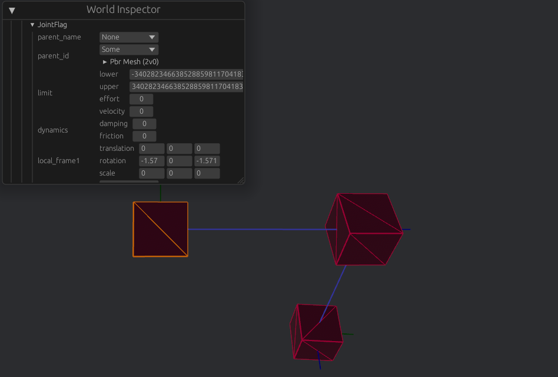

# bevy_serialization_extras

A library that allows the editing of non-reflect components via wrapper components, and serialization of these components via [`moonshine-save`](https://github.com/Zeenobit/moonshine_save):

[demo_gif.webm](https://github.com/rydb/bevy_serialization_extras/assets/43288084/3bda45f1-c75a-437b-a02d-27e58bd3276e)

## Features

- Out of the box serialization Through [`plugins`] for components

```Rust
// Component <-> WrapperComponent
.add_plugins(SerializeComponentFor::<AsyncCollider, ColliderFlag>::default())

// AssetHandle <-> WrapperComponent
.add_plugins(SerializeAssetFor::<StandardMaterial, MaterialFlag3d>::default())

// WrapperComponent -> AssetHandle
.add_plugins(DeserializeAssetFrom::<MeshFlag3d, Mesh>::default())

// Query -> Component, 
.add_plugins(SerializeQueryFor::<Linkage, ImpulseJoint, JointFlag>::default())
```

- Serialization of groups of enities that compose an asset into their singular asset equivillent, and vice-versa

See: <https://github.com/rydb/bevy_serialization_urdf>
```Rust
//Query <-> Asset
.add_plugins(SerializeManyAsOneFor::<LinkQuery, Urdf>::default())
```

- Allows edititing unserializable(non-reflect) implementing components through the wrappers that convert to them

    E.G: Edit Rapier's `ImpulseJoint` through `JointFlag`



- A visualization util to list serializable/unserializable components(W.I.P)


https://github.com/user-attachments/assets/fb1a1b09-db3f-4476-9b0d-800b296ccb8a


## Usage

For implementations of plugin trait bounds, see `/Wrappers`

### TODO

- Add a mechanism for updating from old save versions to new save versions as to not break old save files.
